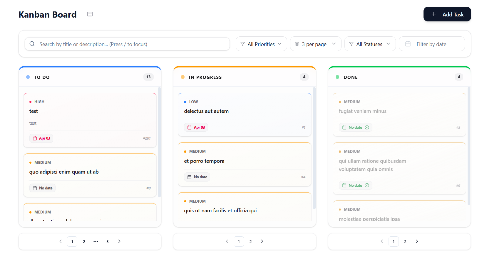

# Kanban Board project



*Preview of the Kanban Board UI*

Hey there! This is a modern Kanban board I've built using React, TypeScript, and Vite. I really wanted something that feels smooth and professional, so I've spent a lot of time on the design and how it feels to use.

## What's cool about it?

- **Super smooth design**: I've used glassmorphism and some really nice colors to make it look premium.
- **Easy Drag & Drop**: You can just grab a task and move it to another column. It feels really natural.
- **Smart Dates**: It'll tell you if a task is overdue, and it won't let you set a due date before the start date.
- **Search and Filters**: You can find what you're looking for instantly by just typing or filtering by priority.
- **Responsive**: It works great on different screen sizes.

## How to get it running?

It's pretty simple to get this up and running on your machine:

1. **Clone it** to your computer.
2. **Install things**: Open your terminal and run:
   ```bash
   pnpm install
   ```
3. **Start it up**: Run this command:
   ```bash
   pnpm run dev
   ```
   Now just head over to http://localhost:5173 and you're good to go!

## How to use it?

- **Adding tasks**: Use the "Add Task" button to create something new.
- **Editing**: Just hover over a card and click the Pencil icon in the corner.
- **Moving things**: Just click and drag cards between columns.
- **Finding stuff**: Type in the search bar or use the / key to focus it quickly.
- **Cleaning up**: Click the Trash icon to delete a task you don't need anymore.

## The Techy Stuff

In case you're curious about how I built it:
- React 19 & TypeScript for the core logic.
- Tailwind CSS v4 for all the styling and colors.
- Zustand and TanStack Query to handle the data piece.
- Framer Motion for all the smooth animations you see.
- @dnd-kit for the drag and drop magic.
